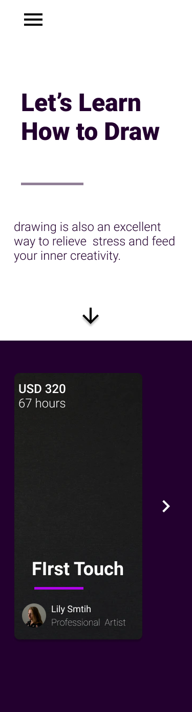

# udemy-2.0
**One of My Old Figma Designs in Swift (XCode)**

**To Run:**
 
 *Step 1:* Download xCode IDE on your apple device (note: must have an apple device) from the app store
 
*Step 2:* Download the zip file from this repo

*Step 3*: Open the zip file in XCode

**Figma Design -**

